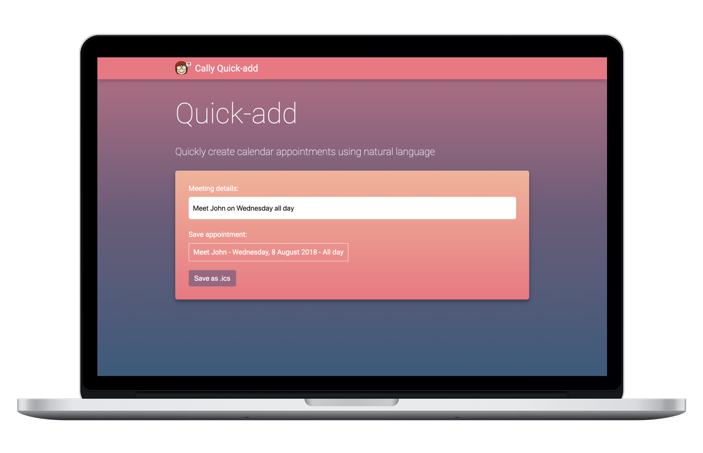

# Cally Quick-Add

A lightweight offline-enabled web application that allows you to create and download calendar appointments (in .ics format) by inputting natural language - e.g. "Meet John next Tuesday at 10 for 2 hours".

See a demo at [cally-js.herokuapp.com](https://cally-js.herokuapp.com)



### But why?
You can use Google Assistant and Siri to create calendar appointments using natural language. However, using them to create appointments using voice or text input takes too much time. It is usually quicker to open Google Calendar in Chrome. Cally Quick-add is designed to load quickly (offline) and allow users to create appointments quickly.

## Deploying to Heroku

Make sure that you have the [Heroku CLI](https://devcenter.heroku.com/articles/heroku-cli) installed.

```
git clone https://github.com/alirawashdeh/cally-quickadd.git
cd cally-quickadd
heroku create
git push heroku master
```

## Credits

Thanks to [nwcell/ics.js](https://github.com/nwcell/ics.js) which is used to create and download .ics files. This applications uses a fork of this repository: [alirawashdeh/ics.js](https://github.com/alirawashdeh/ics.js). This application also uses [Cally JS](https://github.com/alirawashdeh/callyjs), a lightweight javascript library for parsing text into calendar appointments.
