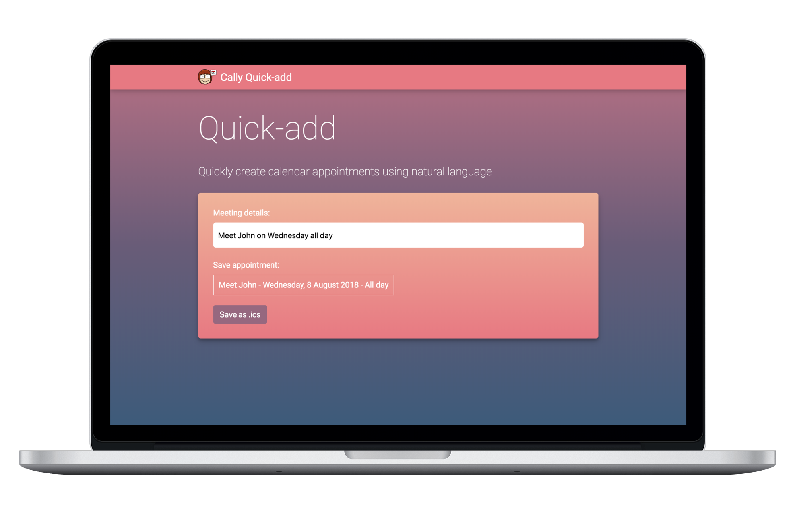

# Cally Quick-Add

A lightweight offline-enabled web application that allows you to create and download calendar appointments (in .ics format) by inputting natural language - e.g. "Meet John next Tuesday at 10 for 2 hours".

Try it out at [https://alirawashdeh.github.io/cally-quickadd/](https://alirawashdeh.github.io/cally-quickadd/)



### But why?
You can use Google Assistant and Siri to create calendar appointments using natural language. However, using them to create appointments using voice or text input takes too much time. It is usually quicker to open Google Calendar in Chrome. Cally Quick-add is designed to load quickly (offline) and allow users to create appointments quickly.

## Deploying to GitHub Pages

This is now a static HTML site that can be deployed to GitHub Pages:

1. Fork or clone this repository
2. Push to your GitHub repository
3. Go to repository Settings → Pages
4. Select source as "Deploy from a branch" and choose main branch
5. Your site will be available at `https://username.github.io/repository-name`

## Local Development

To run locally:
```bash
python3 -m http.server 8000
```
Then open http://localhost:8000 in your browser.

## Credits

Thanks to [nwcell/ics.js](https://github.com/nwcell/ics.js) which is used to create and download .ics files. This applications uses a fork of this repository: [alirawashdeh/ics.js](https://github.com/alirawashdeh/ics.js). This application also uses [Cally JS](https://github.com/alirawashdeh/callyjs), a lightweight javascript library for parsing text into calendar appointments.
